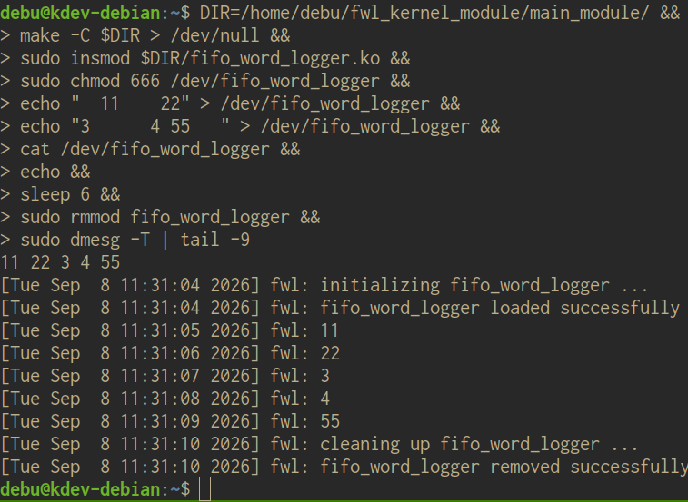
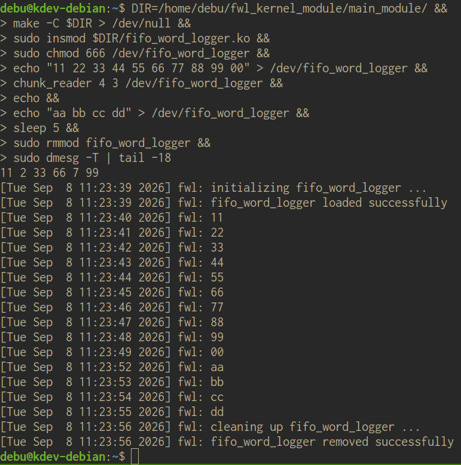

# FWL - FIFO Word Logger
*C, concurrency, per-OFD state, transactional state mutation, resource exhaustion, workqueues, Linux kernel 6.12.105, GPL-2.0*

> **What this is:** A dynamically loadable character device\
> **Kernel:** Linux 6.12.105\
> **Environment:** Debian 13 VM, freshly compiled kernel with debugging features enabled\
> **Development time:** ~2.5 weeks, including kernel/toolchain setup, research, implementation, and testing

What looks deceptively simple at the surface turned into a hog of complexity, once taken seriously:
Write words into the device, read them back, log them one by one. What could possibly go wrong?

<details>
<summary>Table of Contents</summary>

- [How to run it?](#how-to-run-it)
- [Repository Layout](#repository-layout)
- [Why is this interesting?](#why-is-this-interesting)
- [What this demonstrates](#what-this-demonstrates)
- [Architecture overview](#architecture-overview)
- [Semantics](#semantics)
  - [Words](#words)
    - [What is a word?](#what-is-a-word)
    - [What if a word spans across multiple writes?](#what-if-a-word-spans-across-multiple-writes)
    - [Stream construction for read() or "How does this look like?"](#stream-construction-for-read-or-how-does-this-look-like)
    - [Logging](#logging)
    - [The tricky part: How to make friends of logging and read()?](#the-tricky-part-how-to-make-friends-of-logging-and-read)
    - [Resource limits](#resource-limits)
- [Implementation](#implementation)
  - [General locking scheme](#general-locking-scheme)
  - [Custom types](#custom-types)
  - [Transactions](#transactions)
  - [Logging](#logging-1)
    - [Two states](#two-states)
  - [The read cursor and node indexing](#the-read-cursor-and-node-indexing)
    - [Things to note about the cursor implementation](#things-to-note-about-the-cursor-implementation)
  - [Memory accounting](#memory-accounting)
- [Testing](#testing)
    - [Overview of performed testing duties](#overview-of-performed-testing-duties)
- [What I have learned](#what-i-have-learned)
- [Possible refinements for future iterations](#possible-refinements-for-future-iterations)
- [AI usage](#ai-usage)

</details>

**simple writing, reading, and logging**



<details>
<summary>interleaved reading getting disrupted by logging</summary>



([chunk_reader](https://github.com/alneuma/chardev_test_utils) is a small C program that does read from a file with specified write buffer sizes in specified intervals and prints the result to stdout.)

</details>

## How to run it?

Fire up a VM loaded with Linux kernel version 6.12.105, then:

```bash
$ git clone https://github.com/alneuma/fwl_kernel_module.git
$ make -C fwl_kernel_module/main_module
$ sudo insmod fwl_kernel_module/main_module/fifo_word_logger.ko
$ sudo chmod 666 /dev/fifo_word_logger
$ echo "Your cool message!" > /dev/fifo_word_logger && cat /dev/fifo_word_logger
$ sudo dmesg -Tw
```

## Repository Layout
```text
main_module/           the module itself: fifo_word_logger.c + Makefile
experiments/           experiments I used to explore kernel concepts
  word_lister/         word parsing + per-OFD state, no logging yet
  periodic_logger/     delayed-work logging + timer-drift, no word queue yet
kernel_build/          buildinfo of the custom 6.12.105 kernel used for testing
logs/                  screenshots and textual logfiles
```

## Why is this interesting?

What sounds simple at the surface turns out to come with a lot of decisions concerning architecture and semantics:

- What happens when a write stops in the middle of a word?
- What happens when different reads/writes happen concurrently?
- What happens when different reads/writes of the same OFD (open file description) happen concurrently?
- What happens when an OFD reads and its last read ended within a word that now is dequeued?
- How to handle partially successful reads/writes?
- What happens under different failure conditions?
- How to manage resource limits?

## What this demonstrates

- Designing concurrent shared state in kernel-space
- Maintaining per-OFD state across independent accesses
- Making multi-stage writes commit atomically
- Handling resource accounting
- Handling partial failures of read() and write()
- Coordinating synchronous operations with asynchronous mutation
- Reasoning about object lifetime and stale references

## Architecture overview

The central data structure is a queue of words implemented as a list. Writing to the device appends words to this queue. Reading from the device returns the current content of the queue. For this purpose the content is formatted as a stream of words separated by single byte separators. As long as there are enqueued words, once a second a callback removes the first word from the queue and logs it. There are five execution contexts contending for shared state:

| Context | Accesses |
|-|-|
| `open()` | Access device-wide memory accounting while attempting to allocate memory for per-OFD data |
| `read()` | Read the queue |
| `write()` | Write to the queue and access device wide memory accounting when attempting to commit changes to it |
| `release()` | Access device wide memory accounting. Also might write potentially unfinished words to the queue. |
| `work_handler()` | The callback writes to the queue, i.e. removes words. Also accesses device wide memory accounting. |

- To account for read position and unfinished words, OFDs save their per-OFD state between accesses.
- To keep track of read position a `struct cursor` is employed, which references word nodes and whose validity can be verified by a node indexing system.
- Per-OFD state is protected by an OFD-local mutex.
- Device-wide state is protected by two rw-semaphores, separating reads from writes to keep lock contention minimal.
- Changes to the queue through write are first created and validated within a transaction object, before they atomically get committed to the queue.
- A self-rescheduling work item once per second asynchronously removes words from the queue and logs them.

## Semantics

What is a word and how do you want it? Defining precise semantics proved to be much more challenging than I initially expected.

### Words

#### What is a word?

A word is any number of bytes delimited by separators.
A separator is any of the following:
- the zero byte
- the FWL_WORD_SEP byte, a compile-time constant, currently a space
- any byte in the set defined by the isspace() function
The first byte written through an OFD is considered to be preceded by a separator.
The last byte written through an OFD, before release() gets called is considered to be followed by a separator.

All in all, a rather long-winded way of saying that a word is pretty much exactly what you would expect it to be.

#### What if a word spans across multiple writes?

Let's imagine we have this:
```C
write(device_fd, "Hel", 3);
write(device_fd, "lo", 2);
close(device_fd);
```
What we want is one word, `Hello`, not two words, `Hel` and `lo`.

Now let's imagine that we have two threads referencing two different OFDs, writing concurrently:
```C
/* Thread A */
int device_fd_a = open(...);
write(device_fd_a, "Hel", 3);
write(device_fd_a, "lo", 2);
close(device_fd_a);

/* Thread B */
int device_fd_b = open(...);
write(device_fd_b, "Goo", 3);
write(device_fd_b, "dbye", 4);
close(device_fd_b);
```
The only permissible outcome is two words `Hello` and `Goodbye` in any order. What is not permissible are abominations like `Heldbye` or `Goolo` or even more terrible things like `loGoo` or `GooHel`.

This is semantics, but it already points us at an important aspect of the implementation: There needs to be per-OFD state, remembering pending words.

#### Stream construction for read() or "How does this look like?"

Read returns a representation of the current content of the queue. I simply construct a stream of the queue's words separated by FWL_WORD_SEP (i.e. space):
```
Hello -- how -- are -- you?
```
Should produce
```
"Hello how are you?"
```
to the read buffer.

As there is no guarantee that the whole stream can be consumed by a single call to read(), this hints at another implementation detail: More per-OFD state is required to keep track of a reader's position.

#### Logging

When the queue's state switches from *empty* to *non-empty*, one second later, the first word of the queue is logged and removed from the queue. From then on logging repeats every second. This stops, once the last word is removed from the queue. We can think of two separate states with different device behavior associated.

| state | behavior |
|-|-|
| *queue is empty* | no logging happens |
| *queue is non-empty* | logging and dequeuing words happens once a second |

#### The tricky part: How to make friends of logging and read()?

Let's imagine a scenario where we have a non-empty queue, so logging is active.
```
Hello -- how -- are -- you?
```
One reader joins in and the following scenario unfolds:
```
read of size 4 -> returns "Hell"
read of size 4 -> returns "o ho"
logging, removes "Hello"
logging, removes "how"
logging, removes "are"
read of size 4 -> ?
```
If no logging had happened between reads and the queue was left in its original state, we would expect the final read to return `w ar`. But the removal of words has invalidated the read-cursor's position. `how` and `are` are no longer in the queue.

There are at least three ways to deal with this problem in a way that would semantically make sense:

1. `w ar`: The read continues as if nothing had happened. Until the read is over, the words are still in memory. It is just the logger that has moved on.
2. `w yo`: The read completes reading the word it last left, then jumps to the first word of the queue and continues from there.
3. ` you`: The read immediately jumps to the first word of the queue

While all of those solutions seem reasonable, I decided to go with 3. There are at least three big advantages:
- Less state tracking, less error-prone
- No awkward memory hogging by OFDs that refuse to go on reading
- A more accurate representation of the *current* state of the queue.

```
? = " you"
```

#### Resource limits

##### Persistent memory

There is a limit on persistent memory, currently hard-coded as *1 MB* [(which is not fully accurate)](#memory-accounting). This is memory used by the queue itself and memory used to save per-OFD state.
Only `write()` and `open()` can make the device claim more persistent memory. If they try to do so but no more memory is available, `-ENOSPC` is returned.

##### Indices

This is more of an implementation detail, but important to note: There is a [maximum number of words](#indices-are-finite) that can be enqueued throughout the lifetime of the module. Under normal operations, this should never happen within our lifetime, but if it does, also `-ENOSPC` is returned by either `write()` or `open()`.

## Implementation

There are a couple of general considerations:

1. Memory is limited
The amount of memory occupied by the device must be limited. We are in kernel-space; unbounded memory consumption can be really bad.
2. Concurrency is everywhere
Reads and writes through the same or from different OFDs can happen at any time. As long as the queue is not empty logging and word dequeuing can always interfere with those.
3. There is no *libc*, we cannot use system calls, we provide them. All the help at our disposal comes from the internal Linux kernel API.
4. Everything can fail
Pretty much the same as in user-space, but it somehow feels more real.

### General locking scheme
I am using two read/write semaphores for managing shared state, as well as one mutex per-OFD to protect per-OFD state from concurrent reads or writes. Here is an overview:

| lock order | name | function |
|-|-|-|
| 1 | `ofd_data.lock` | OFD private mutex protecting OFD state from concurrent accesses through the same OFD |
| 2 | `rw_sem_logging` | read/write semaphore protecting device-wide shared data in situations where the only disrupting interference to readers could come from the word logging and dequeuing mechanism |
| 3 | `rw_sem_user` | read/write semaphore protecting all accesses to device-wide shared data. It is called `*_user` because these accesses typically happen when data is transferred from or to user-space. An exception to this is when the first word gets dequeued during a logging event. |

Not taking into account data, that is exclusively used by `fwl_init()` and `fwl_exit()`, the following device-wide shared variables exist:

| name | function |
|-|-|
| `word_list` | the word queue |
| `mem_used` | persistent(!) dynamic memory occupied by the device, allocator overhead not taken into account |
| `node_idx_counter` | counter kept for indexing queue nodes |
| `node_idx_num_reserved` | number of reserved queue node indices |

### Custom types

| name | function |
|-|-|
| `struct fwl_word` | represents words as nodes of the queue |
| `struct fwl_cursor` | used by read() to represent a position inside of the stream constructed from the word queue |
| `struct fwl_ofd` | used to store per-OFD state: `struct fwl_cursor`, a pointer to a `struct fwl_word` for pending unterminated words from prior writes and a mutex to protect this state from concurrent accesses |
| `struct fwl_transaction_write` | this is used to prepare and validate data received by write() before it is committed to the device's persistent state |

### Transactions
When a write happens, data flows from user-space to the device. Many things can go wrong. Before any changes are committed to the device's persistent state, a transaction object is prepared and validated. If any non-recoverable error happens, the transaction object is dropped and the device's persistent state stays untouched. If the transaction is safe to be committed, this happens in one atomic event protected by `rw_sem_user`.

```C
/* the transaction type */
struct fwl_transaction_write {
	struct list_head words;
	struct fwl_word *stash;
	size_t bytes_copied;
};

/* the most relevant functions */
static int fwl_transaction_populate_locked();
static int fwl_transaction_commit_locked();
```

The write function stack-allocates a transaction object. Together with the user-provided buffer, and a possible pending unfinished word from the OFD's private data, this object is then passed to `fwl_transaction_populate_locked()`. Here the whole transaction gets prepared: A word list (`words`) gets created together with a potentially new pending unfinished word (`stash`). If this succeeds, write will call `fwl_transaction_commit_locked()`. Here checks for node index and memory exhaustion are performed. If they succeed the relating shared state is updated, before the indexed list segment is appended to the word queue and the OFD's old `stash` gets replaced by the new one provided by the transaction.
Both `fwl_transaction_populate_locked()` and `fwl_transaction_commit_locked()` need to be protected by the OFD-local mutex, while only for the latter `rw_sem_user` needs to be locked for writing.

### Logging

Logging is implemented by self-rescheduling work items and a single callback function.

#### Two states
There are two relevant states: `queue empty` and `queue non-empty`.

##### queue empty
As long as the queue is empty, no new work items are scheduled. If the callback function is currently executing, then it has already reached a state in which it has determined that it won't self-reschedule.

##### queue non-empty
When the queue is non-empty a work item is already scheduled or about to be scheduled. The periodically (1 second intervals) executed callback function deletes the first word in the queue and then reschedules the work item if `queue non-empty` still persists. Timer drift is prevented by the callback function calculating the ideal execution time of the next callback relative to the ideal execution time of the current. The ideal execution time then is compared to the current time to determine for how many `jiffies` in the future the next callback should be scheduled.

##### transitions

Every transition from `queue empty` to `queue non-empty` happens atomically and is fully controlled by `write()` and `release()`. The atomicity ensures that no scheduling contention happens.

Every transition from `queue non-empty` to `queue empty` also happens atomically and is fully controlled by the callback.

Because `read()` temporarily releases `rw_sem_user` when copying from its internal buffer to the user's read buffer. There is a possibility that the callback removes a word from the queue during this time. Under certain edge cases this could invalidate the read cursor. To prevent this `rw_sem_logging` is used. As logging only happens once a second there should be very little lock contention.

### The read cursor and node indexing

For an OFD to keep track of where in the word queue it has finished its last read operation, words in the queue are indexed and a `struct fwl_cursor` object is saved within the OFD's private data.

```C
struct fwl_cursor {
	struct list_head *ptr; /* points to the word node */
	size_t word_pos; /* remembers the position within the word */
	u32 node_idx; /* saves the index of the node */
};
```

In most cases an OFD can just continue reading from the queue, where it left. `ptr` directly points to the word node and `word_pos` denotes the offset from the beginning of the word. Once we take into consideration that word nodes can be removed from the beginning of the queue during logging events, this gets brittle. What if the exact node the OFD's cursor was pointing to gets removed in between reads? To determine whether a cursor is still valid, its saved `node_idx` is compared against the index of the first node in the queue. A monotonically increasing indexing scheme guarantees that if the cursor's `node_idx` is smaller than the index of the first node, the node the cursor is pointing to is no longer valid. In this case the cursor can be advanced to the first node of the queue.

#### Things to note about the cursor implementation

##### Indices are finite

In the current implementation indices cannot be repurposed. This means that there is the possibility of index exhaustion. The total number words that can be enqueued during the lifetime of the device is capped. In practice this should never happen, as the frequency with which words can be enqueued is capped by the one-second logging interval, once the device's memory limit has been reached. Even if for the sake of the argument we assume a memory limit of *1 GB* instead of *1 MB* and then add a very aggressive index claiming strategy, it would take around 135 years to get there. If this should ever happen `-ENOSPC` is returned.
There is a bookkeeping implication: Per-OFD state keeps track of unfinished words which might be committed to the queue during `release()`. If we want to rule out the semantically awkward case in which a call to `close()` returns `-ENOSPC`, OFDs need to reserve indices for their unfinished words. This happens with a counter, `node_idx_num_reserved`, that keeps track of the total amount of unfinished words held by all OFDs.

An index needs to be reserved for each pending word if we do not ever want to run into `close()` returning `-ENOSPC`.

<details>
<summary>For whoever cares</summary>

The most aggressive way to claim indices is by creating many small words.
A node with a *1 byte* word occupies *33 bytes* of memory.
Thus a memory limit of *1 GB* allows for *32537631* words.
So, right after the device is loaded *32537631* indices can be claimed immediately.
After that a new one byte word can only be enqueued when another one is dequeued. This happens once a second.
If we reserve one number as a sentinel, `u32` provides us with a pool of *2^32 - 1 = 4294967295* indices.
So there are *4294967295 - 32537631 = 4262429666* seconds left during which one *1 byte* word per second needs to be enqueued until indices are exhausted.
This is roughly *135* years.

</details>

##### A different implementation strategy without `ptr`

Restoring the read position works without the node pointer in the cursor struct. The index is enough. At each read, the queue can simply be traversed until the word with the right index is found. The traversal can be done with a maximum of `n / 2`, where `n` is the number of words in the queue: We can check if the saved index is closer to that one of the first node or the last node in the queue and then traverse from the cheaper direction (we do have a doubly linked list). Also the number of nodes is naturally capped by the device's memory limit. Performance differences might only be noticed when there is a large and fully used memory limit and many reads are issued with small buffer sizes.
An advantage of the index only approach is that there is one less pointer variable per-OFD to occupy memory and maybe more importantly, one fewer variable whose state needs to be tracked.

### Memory accounting

The current strategy for memory accounting enforces a device-wide limit on dynamic memory claimed by the device for maintaining persistent state. It accounts for queue nodes and per-OFD state.
It does however not account for allocator overhead and transient memory usage, e.g. when write() constructs a transaction. This is a known limitation.

## Testing

I mainly tested manually by modifying compile-time constants like resource limits and logging interval or by modifying the code to enforce failure paths. Two small user-space C programs were specifically written to test the module.

These programs are:

[chunk_writer](https://github.com/alneuma/chardev_test_utils): takes an input string and writes it to stdout with a fixed write buffer size that is provided as a command line argument. Used for testing correct word parsing.
[chunk_reader](https://github.com/alneuma/chardev_test_utils): reads with fixed buffer sizes from a file and prints to stdout. The buffer size, as well as a delay between reads can be passed as command line arguments. This was most helpful when testing the read() during synchronous modification of the word queue by the logging mechanism.

KASAN, kmemleak and lockdep offered some help as well.

I have not stress tested the module with multiple concurrent accesses.

### Overview of performed testing duties

| Area | Designed for | Tested |
|-|-|-|
| per-OFD managed partial words across writes | Yes | Yes |
| Small read()/write() buffers | Yes | Yes |
| Very large read()/write() buffer | Yes | Yes |
| Queue mutation in between reads | Yes | Yes |
| Resource exhaustion | Partially | Yes |
| Allocation failures | Yes | Partially |
| Concurrent reads | Yes | No |
| Concurrent writes | Yes | No |
| Concurrent read/write | Yes | No |
| Multiple concurrent OFDs | Yes | No |

## What I have learned

I came into this with some background in user-space C and Linux, but had never touched the kernel. The hardest part wasn't learning the API or setting up the development environment; it was learning to reason about execution contexts, concurrency, ownership, and object lifetime. Questions like:

- What happens when another execution context removes an object I am referencing?
- How can a multi-stage operation fail without corrupting persistent state?
- Which operations need to be mutually exclusive?
- How should resource limits interact with object lifetime and error handling?

are haunting me to this day.

## Possible refinements for future iterations

- automated and much more substantial testing employing common tools
- add a limit to the size of a single word
- add command line configuration during module loading
    - word size limit
    - logging interval
    - memory limit
- rework memory management
- implementing poll() and blocking behavior when appropriate
- more systematic documentation of invariants and concurrency arguments

## AI usage

- locating relevant kernel documentation
- clarifying unfamiliar APIs/concepts
- reviewing already-written code
- exploring potential failure cases
